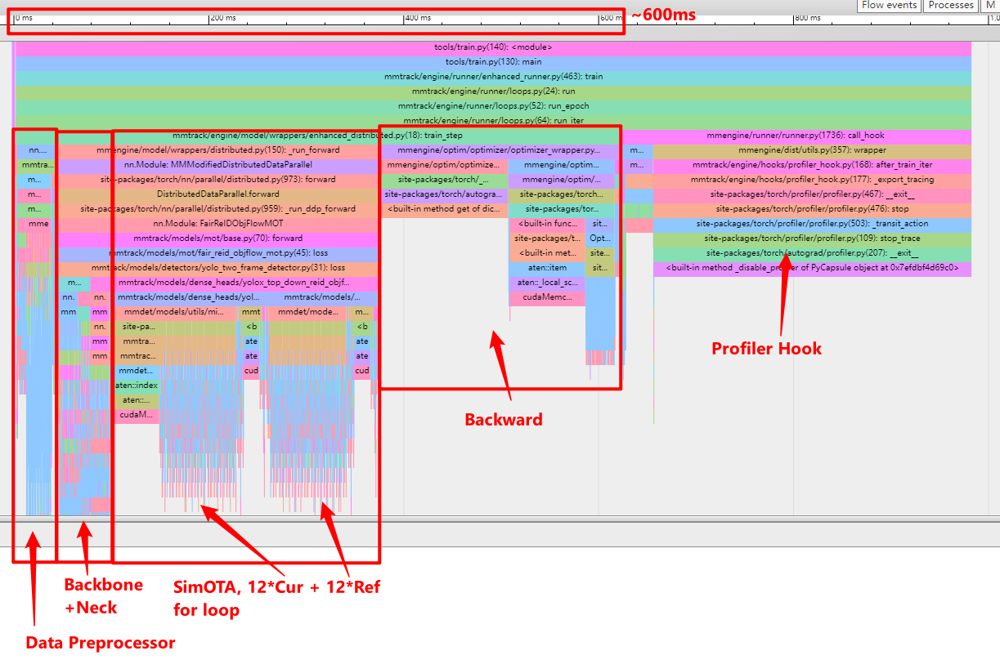

# CSCI596 Final Project: Training Acceleration of YOLOX

Name: Zhangyu Jin

Email: zjin8285@usc.edu, USC ID: 3350238372

## Introduction of YOLOX

### You Only Look Once

The [YOLO](https://arxiv.org/abs/1506.02640) (You Only Look Once) algorithm was first introduced in 2015 to solve the object detection problem. It aims to predict a class of an object and the bounding box that defines the object location on the input image. It recognizes each bounding box using four numbers:

1. Center of the bounding box ($b_{x}$, $b_{y}$)
2. Width of the box ($b_{w}$)
3. Height of the box ($b_{h}$)

In addition to that, YOLO predicts the corresponding number c for the predicted class as well as the probability of the prediction ($P_{c}$)

### You Only Look Once X

[YOLOX](https://arxiv.org/abs/2107.08430v2) is a single-stage object detector that makes several modifications to YOLOv3 with a DarkNet53 backbone. Specifically, YOLO’s head is replaced with a decoupled one. This is the model architecture.

### YOLOX Performance on COCO

Here are the YOLOX performances on the COCO object detection dataset.

|  Backbone  | Size | Batch Size | AMP | RTMDet-Hyp | Mem (GB) |   Box AP    |                          Config                           |                                                                                                                                                                      Download                                                                                                                                                                      |
| :--------: | :--: | :--------: | :-: | :--------: | :------: | :---------: | :-------------------------------------------------------: | :------------------------------------------------------------------------------------------------------------------------------------------------------------------------------------------------------------------------------------------------------------------------------------------------------------------------------------------------: |
| YOLOX-tiny | 416  |    8xb8    | No  |     No     |   2.8    |    32.7     |       [config](./yolox_tiny_fast_8xb8-300e_coco.py)       |                                   [model](https://download.openmmlab.com/mmyolo/v0/yolox/yolox_tiny_8xb8-300e_coco/yolox_tiny_8xb8-300e_coco_20220919_090908-0e40a6fc.pth) \| [log](https://download.openmmlab.com/mmyolo/v0/yolox/yolox_tiny_8xb8-300e_coco/yolox_tiny_8xb8-300e_coco_20220919_090908.log.json)                                   |
| YOLOX-tiny | 416  |   8xb32    | Yes |    Yes     |   4.9    | 34.3 (+1.6) | [config](./yolox_tiny_fast_8xb32-300e-rtmdet-hyp_coco.py) | [model](https://download.openmmlab.com/mmyolo/v0/yolox/yolox_tiny_fast_8xb32-300e-rtmdet-hyp_coco/yolox_tiny_fast_8xb32-300e-rtmdet-hyp_coco_20230210_143637-4c338102.pth) \| [log](https://download.openmmlab.com/mmyolo/v0/yolox/yolox_tiny_fast_8xb32-300e-rtmdet-hyp_coco/yolox_tiny_fast_8xb32-300e-rtmdet-hyp_coco_20230210_143637.log.json) |
|  YOLOX-s   | 640  |    8xb8    | Yes |     No     |   2.9    |    40.7     |        [config](./yolox_s_fast_8xb8-300e_coco.py)         |                               [model](https://download.openmmlab.com/mmyolo/v0/yolox/yolox_s_fast_8xb8-300e_coco/yolox_s_fast_8xb8-300e_coco_20230213_142600-2b224d8b.pth) \| [log](https://download.openmmlab.com/mmyolo/v0/yolox/yolox_s_fast_8xb8-300e_coco/yolox_s_fast_8xb8-300e_coco_20230213_142600.log.json)                               |
|  YOLOX-s   | 640  |   8xb32    | Yes |    Yes     |   9.8    | 41.9 (+1.2) |  [config](./yolox_s_fast_8xb32-300e-rtmdet-hyp_coco.py)   |       [model](https://download.openmmlab.com/mmyolo/v0/yolox/yolox_s_fast_8xb32-300e-rtmdet-hyp_coco/yolox_s_fast_8xb32-300e-rtmdet-hyp_coco_20230210_134645-3a8dfbd7.pth) \| [log](https://download.openmmlab.com/mmyolo/v0/yolox/yolox_s_fast_8xb32-300e-rtmdet-hyp_coco/yolox_s_fast_8xb32-300e-rtmdet-hyp_coco_20230210_134645.log.json)       |
|  YOLOX-m   | 640  |    8xb8    | Yes |     No     |   4.9    |    46.9     |        [config](./yolox_m_fast_8xb8-300e_coco.py)         |                               [model](https://download.openmmlab.com/mmyolo/v0/yolox/yolox_m_fast_8xb8-300e_coco/yolox_m_fast_8xb8-300e_coco_20230213_160218-a71a6b25.pth) \| [log](https://download.openmmlab.com/mmyolo/v0/yolox/yolox_m_fast_8xb8-300e_coco/yolox_m_fast_8xb8-300e_coco_20230213_160218.log.json)                               |
|  YOLOX-m   | 640  |   8xb32    | Yes |    Yes     |   17.6   | 47.5 (+0.6) |  [config](./yolox_m_fast_8xb32-300e-rtmdet-hyp_coco.py)   |       [model](https://download.openmmlab.com/mmyolo/v0/yolox/yolox_m_fast_8xb32-300e-rtmdet-hyp_coco/yolox_m_fast_8xb32-300e-rtmdet-hyp_coco_20230210_144328-e657e182.pth) \| [log](https://download.openmmlab.com/mmyolo/v0/yolox/yolox_m_fast_8xb32-300e-rtmdet-hyp_coco/yolox_m_fast_8xb32-300e-rtmdet-hyp_coco_20230210_144328.log.json)       |
|  YOLOX-l   | 640  |    8xb8    | Yes |     No     |   8.0    |    50.1     |        [config](./yolox_l_fast_8xb8-300e_coco.py)         |                               [model](https://download.openmmlab.com/mmyolo/v0/yolox/yolox_l_fast_8xb8-300e_coco/yolox_l_fast_8xb8-300e_coco_20230213_160715-c731eb1c.pth) \| [log](https://download.openmmlab.com/mmyolo/v0/yolox/yolox_l_fast_8xb8-300e_coco/yolox_l_fast_8xb8-300e_coco_20230213_160715.log.json)                               |
|  YOLOX-x   | 640  |    8xb8    | Yes |     No     |   9.8    |    51.4     |        [config](./yolox_x_fast_8xb8-300e_coco.py)         |                               [model](https://download.openmmlab.com/mmyolo/v0/yolox/yolox_x_fast_8xb8-300e_coco/yolox_x_fast_8xb8-300e_coco_20230215_133950-1d509fab.pth) \| [log](https://download.openmmlab.com/mmyolo/v0/yolox/yolox_x_fast_8xb8-300e_coco/yolox_x_fast_8xb8-300e_coco_20230215_133950.log.json)                               |

## Speed Analysis of Training YOLOX

Our project focuses on the training acceleration of YOLOX. Here we use a Profiler Hook to analyze the training time distribution on one iteration. Here we have several parts

- Data Preprocessor. This is to process the input image within the same batch. For example, it would resize each batch into different resolutions if we have multi-resolution during training time.
- YOLOX Backbone. This is the Darknet35 backbone.
- YOLOX Neck. This is FAPAN neck.
- YOLOX Head. This part includes several sub-parts.
    - YOLOX Head Module. This part includes Classification Head and Regression Head.
    - SimOTA. This is the assigner that would assign the ground truth bounding box to the prediction bounding box.
    - Loss. Classification loss is basically Cross Entropy Loss, objectness loss is Binary Cross Entropy Loss, and bounding boxes loss is IoU Loss. Additionally, bounding boxes aux loss is L1 Loss.
- Backward.
- Profiler Hook. This is the profiler that would collect all of the time cost for each function.

Here our batchsize is 12 and input resolution is (860, 480). So it is not hard to find that the most time consuming part is SimOTA.

## SimOTA Understanding

### OTA

The authors of [OTA](https://arxiv.org/abs/2103.14259) define the OT problem as one which has “m supplies and n demanders in a certain area. The i-th supplier holds sᵢ units of goods while the j-th demanded needs dⱼ units of goods. Transporting cost for each unit of good from one suplier i to demander j is denoted as cᵢⱼ. The goal of the problem is to find a transportation plan 𝝅* according to which all goods from suppliers can be transported to demanders at a minimal transportation cost.”

### SimOTA

In SimOTA, the algorithm assigns labels to ground truth objects by solving an optimization problem to determine the most appropriate ground truth object to assign to each predicted bounding box. This approach is more efficient than traditional label assignment methods and has been shown to improve the average precision of the model.

The SimOTA algorithm looks like the following:

1. Assign m and n as the counts of the number of ground truths and number of anchors
2. Get the class predictions Pᶜˡˢ and the regression predictions Pᵇᵒˣ by sending image I through the model.
3. Create the supplying vector, s, which has m + 1 values. Use dynamic k estimation to get the supply of each gt and store it in the vector.
4. s[m+1] = n — sum(s), The background supply at location m + 1 in the supplying vector is equal to the n — sum(s)
5. Initialize the demanding vector, d, as a vector of size n filled with ones.
6. Get the pairwise cls loss between each jth prediction and its corresponding ith ground truth label. cᶜˡˢ = FocalLoss(Pᶜˡˢ, Gᶜˡˢ)
7. Get the pairwise reg loss between each jth prediction and its corresponding ith ground truth label. cʳᵉᵍ = IoULoss(Pᵇᵒˣ, Gᵇᵒˣ)
8. Get the pairwise center prior between each jth anchor and its corresponding ith gt. cᶜᵖ = CenterPrior(Aⱼ, Gᵇᵒˣ)
9. Get the background class cost: cᵇᵍ = FocalLoss(Pᶜˡˢ, Ø)
10. Get the foreground cost: cᶠᵍ = cᶜˡˢ + αcʳᵉᵍ + cᶜᵖ
11. Compute the final cost matrix c by concatenating cᵇᵍ to cᶠᵍ to form a final matrix of shape (m+1, n)
12. Iterate over all supply sᵢ in s and get the top sᵢ best predictions with the lowest cost cᵢ. The resulting array should have m values where each mᵢ index in the resulting array has at most sᵢ predictions.
13. Return the resulting array

## SimOTA in Batch

Our acceleration is based on the implementation of SimOTA. Originally, if we have a batch with size 12, then SimOTA would use for loop to go through them one by one.

For now, we could stack those 12 images into one image along width. As we can see from the image, the bounding boxes would add by an amount $S$. Such that those 12 images are treated as one image.

So the value $S$ should have some limitations,

1. $S$ should be larger or equal to the largest width of the image within the batch. Otherwise bounding boxes would be overlapped by previous image.
2. $S$ cannot be too large. Otherwise it would take additional computational cost.

### Determination of S under FP16

$S$ is quite easy to pick under FP32. But when we turn on the FP16 during the training time, it would be a little bit problematic. We could take a look at the following demo.

We can see that we could meet with overflow problem if the bounding box value is too large, for example, 10000. If that is the case, then our SimOTA in Batch would give totally different result compared with original SimOTA.

So we choose a strategy of $S$.

1. Choose as many images as possible such that total width is under 10000, and form a sub-batch.
2. Repeat the process 1 until all of the images are consumed within the batch.

## Results & Discussion

Here is the result of our acceleration of YOLOX.

|                         | batchsize | time cost | memory cost |
|-------------------------|-----------|-----------|-------------|
| YOLOX w SimOTA          | 12        | 600 ms    | 12 GB       |
| YOLOX w SimOTA in batch | 12        | 520 ms    | 30 GB       |

Our method accelerate from 600ms to 520ms, which is roughly 86.67% of original time cost.

However, at the same time, our memory suddenly increases by 1.5 times. This is because we have a bipartite matching between ground truth and prediction bounding boxes. For example, assume there are 10 objects in ground truth, and prediction would be roughly 500. Then original SimOTA would have a cost matrix of 10\*500=5k, but SimOTA in batch need (10\*12)\*(500\*12)=720k. Even though this matrix is calculated parallely in CUDA, it would still suddenly increase the CUDA memory.

So the advantage of our acceleration method is fewer time cost, but disadvantage is much larger memory cost.